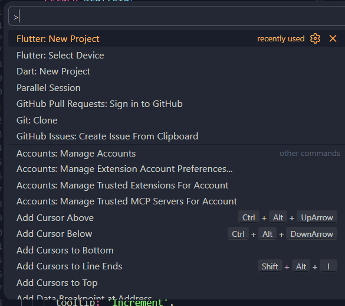
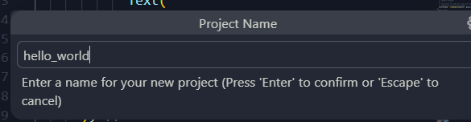
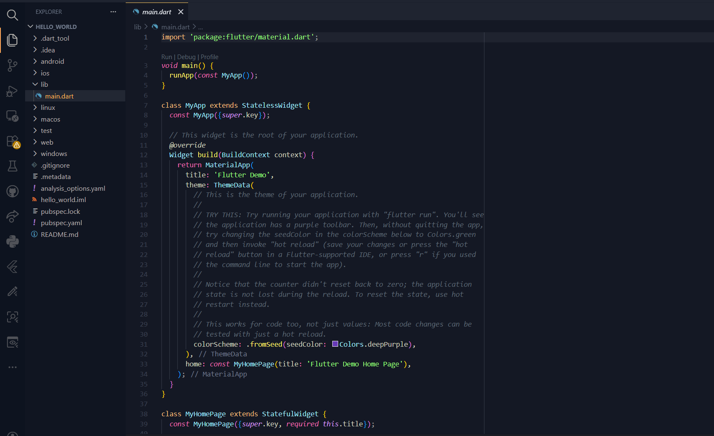
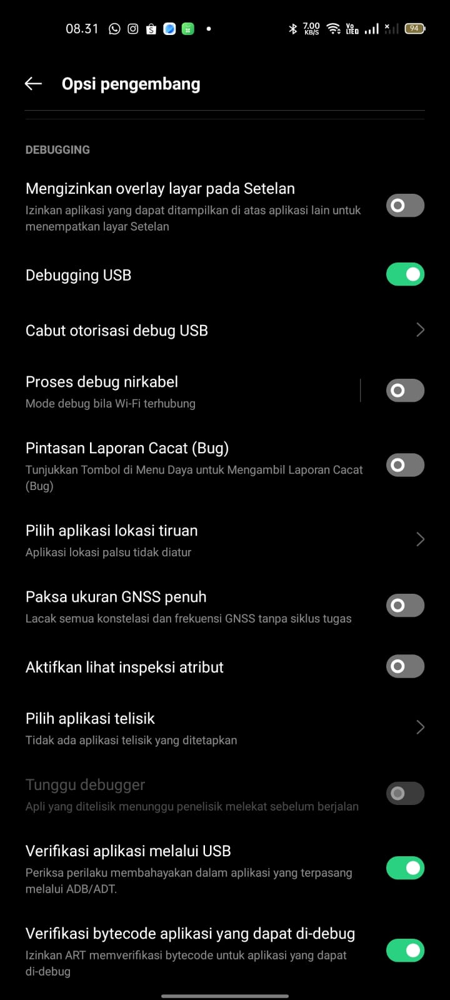
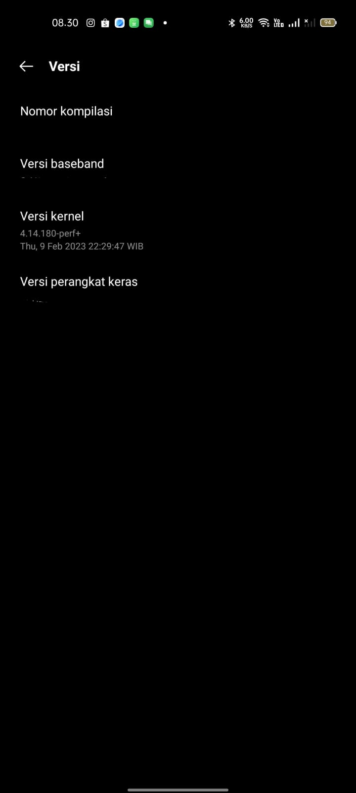
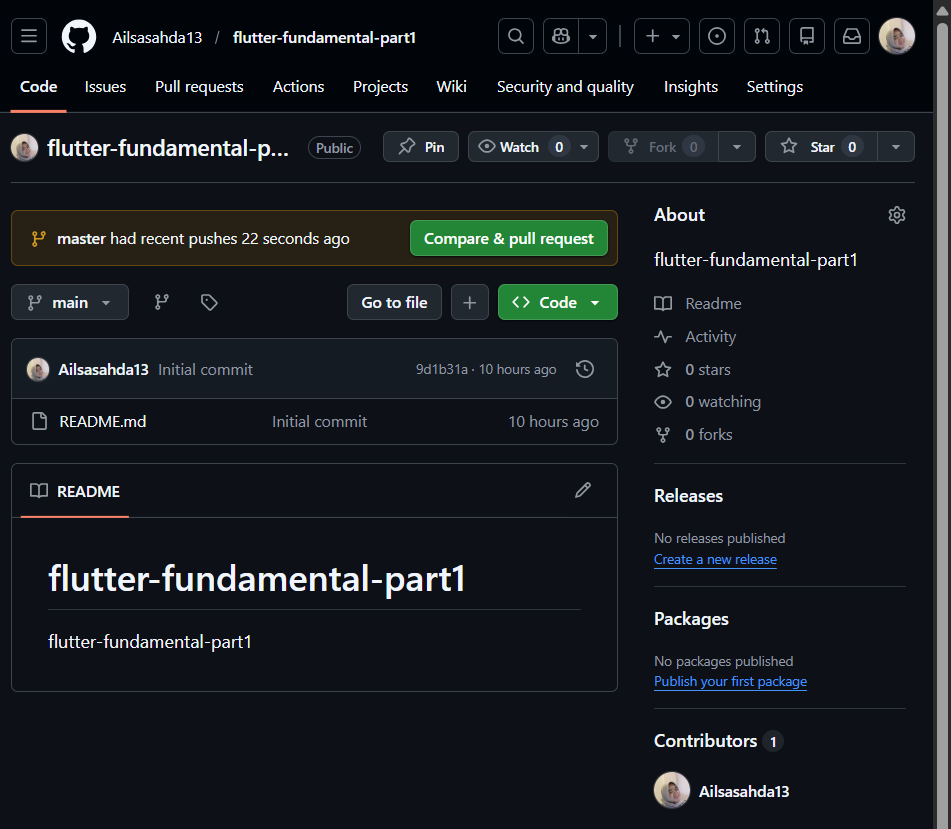
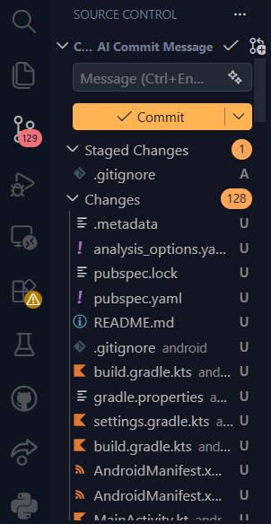
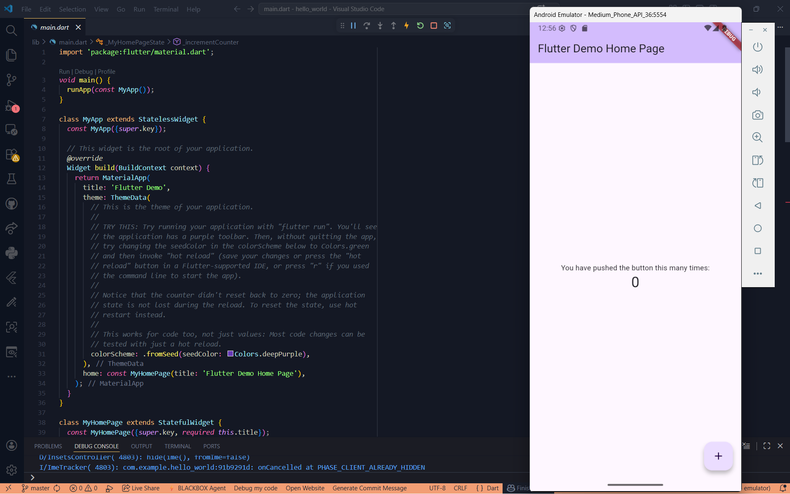

# hello_world
Ailsa Sahda Garizah -- 244107060006

A new Flutter project.

-> Langkah awal untuk membuat project Flutter baru:

-> Proses membuat nama pada saat menginisialisasi project

-> Tampilan file utama sebelum dimodifikasi

-> Pengaturan USB Debugging dan nomor kompilasi agar aplikasi bisa di-running di handphone dan tampilannya dapat tampil di handphone:

-> Proses pembuatan repository dan pengiriman kode ke GitHub:

-> Tampilan awal sebelum dimodifikasi

-> Tampilan setelah dimodifikasi, dengan mengganti body ke nama lengkap

-> Tampilan saat melakukan import text_widget dan tampilannya berubah 

-> Melakukan penampahan logo polinema di dalam folder assets dan melakukan import ke main.dart

-> tampilan dari contoh button loading

-> tampilan dari floating action button

-> Tampilan dari scaffold widget untuk mengatur tata letak sesuai dengan material design

-> tampilan dialog widget 

-> Tampilan untuk menerima input dari pengguna aplikasi

-> Tampilan date and time pickers

